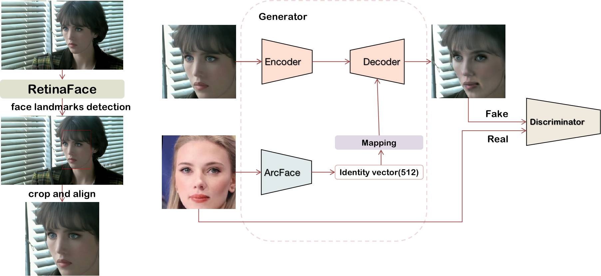

<div align="center">

# Project2:FaceSwap


https://user-images.githubusercontent.com/125641308/234752288-bff92dc7-c647-4ed8-be84-4927dccfd479.mp4


https://user-images.githubusercontent.com/125641308/234752240-1c1cad63-124d-4de8-a02a-cd1d5a5a90bd.mp4


## Abstract
>In this work, we present a new single-stage method for
>subject agnostic face swapping and identity transfer, named
>FaceDancer. We have two major contributions: Adaptive
>Feature Fusion Attention (AFFA) and Interpreted Feature
>Similarity Regularization (IFSR). The AFFA module is embedded
> in the decoder and adaptively learns to fuse attribute
> features and features conditioned on identity information
> without requiring any additional facial segmentation process.
>In IFSR, we leverage the intermediate features
> in an identity encoder to preserve important attributes
> such as head pose, facial expression, lighting, and occlusion
> in the target face, while still transferring the identity
> of the source face with high fidelity. We conduct extensive
> quantitative and qualitative experiments on various
> datasets and show that the proposed FaceDancer outperforms
> other state-of-the-art networks in terms of identity
> transfer, while having significantly better pose preservation
> than most of the previous methods.



For a quick play around, you can check out a version of FaceDancer hosted on [Hugging Face](https://huggingface.co/spaces/felixrosberg/face-swap). The Space allow you to face swap images, but also try some other functionality I am currently researching, which I plan to publish soon. For example, reconstruction attacks and adversarial defense against the reconstruction attacks.


## Getting Started
This project was implemented in TensorFlow 2.X. For evaluation we used models implemented in both TensorFlow and PyTorch (e.g CosFace from [InsightFace](https://github.com/deepinsight/insightface/blob/master/recognition/arcface_torch)).

### Installation:
- Install depencies:


```shell
pip install -r requirements.txt
```


#### An alternative installation method if you have difficulty with the previous:
- Clone or download repository
```shell
git clone https://github.com/felixrosberg/FaceDancer.git
cd FaceDancer
```

- Make conda environment
```shell
conda create -n facedancer python=3.8
conda activate facedancer
python -m pip install --upgrade pip
```

- Install depencies:
```shell
conda install -c conda-forge cudatoolkit cudnn
conda install -c conda-forge ffmpeg

pip install tensorflow-gpu
pip install -r requirements.txt
```

