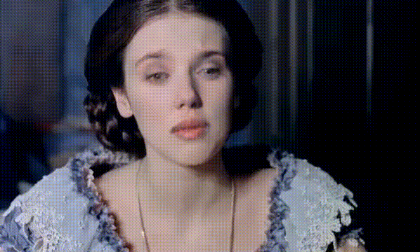
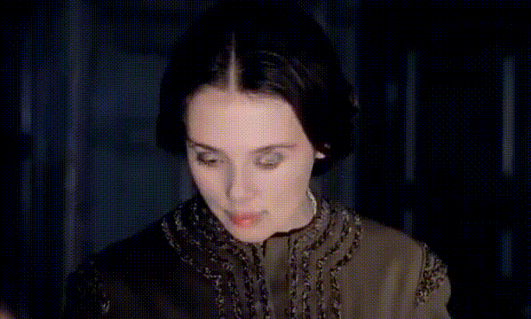

<div align="center">
# Project2:FaceSwap







## Abstract

>Face swapping transfers the identity of a source face into the target face while keeping the attributes(expressions,pose,lighting conditions) of the target face consistent.In this project,we implement a face-swapping framework called FaceSwap which can transfer the identity of an arbitrary source face into an arbitrary target face.The FaceSwap model is composed of a generator,a discriminator and a transformation network forming a conditional GAN model.Pre trained models RetinaFace and ArcFace are used to detect faces and extract identities.As a result,the framework is able to producing high fidelity and photo-realistic swapped faces in complex environments.


### Installation:
- Install depencies:


```shell
pip install -r requirements.txt
```

### Web application:

```
gradio web.py 
```

